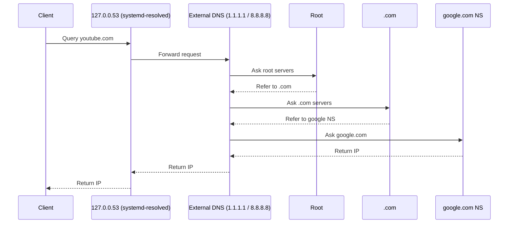
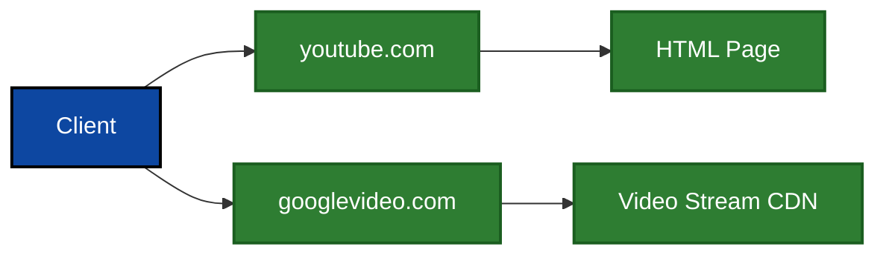
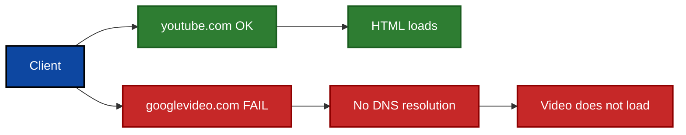
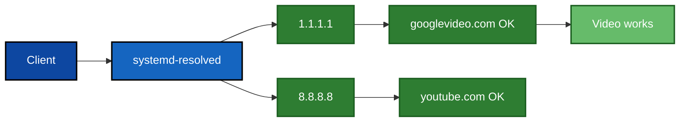
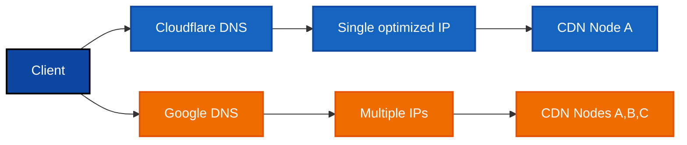
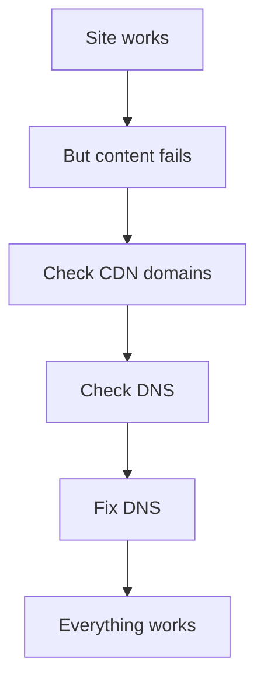

<p align="right">
  <b>English</b> | <a href="./README.ru.md">Русский</a>
</p>

# 🛠️ Fix: YouTube opens but videos don't load (DNS / CDN issue on VPS)

## 📖 Overview

This guide explains how to diagnose and fix a situation where:

* You can open YouTube (`youtube.com`)
* But videos do **not load or play**

---

## 🌐 How DNS resolution works

### 🔄 Standard DNS flow



---

## 🎥 How YouTube actually works



👉 Important:

* `youtube.com` → loads website
* `googlevideo.com` → streams video

---

## ❌ Failure scenario (your case)



---

## 🔍 Root Cause

Provider DNS servers assigned via DHCP

Example:
```
85.193.xxx.xxx
85.193.xxx.xxx
```

❌ These DNS servers returned incomplete or incorrect responses for CDN domains such as `googlevideo.com`, breaking video delivery.

---

## ✅ Fixed architecture



---

## 🌍 Why DNS responses differ



---

## 🧠 Key Insight



---

## 🏁 Conclusion

The issue was caused by:

❌ Broken DNS from hosting provider
✔ Fixed by switching to public DNS

After fix:

* DNS resolution works
* CDN accessible
* YouTube video playback restored

---
