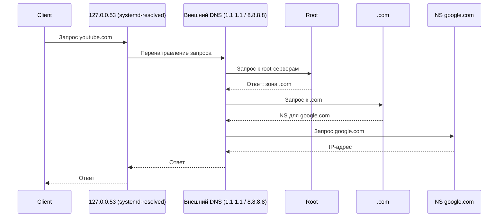
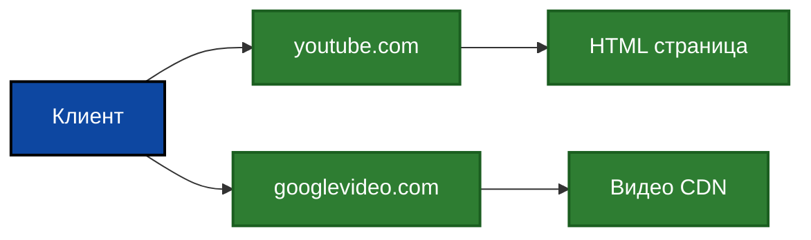
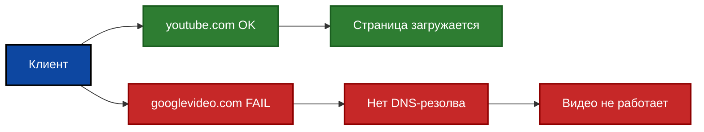
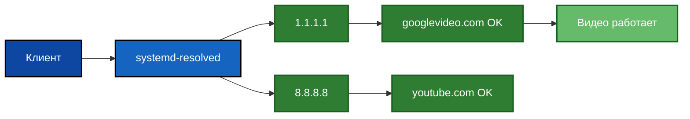
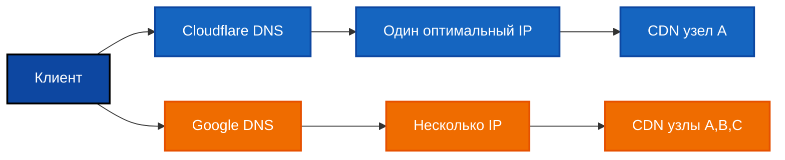
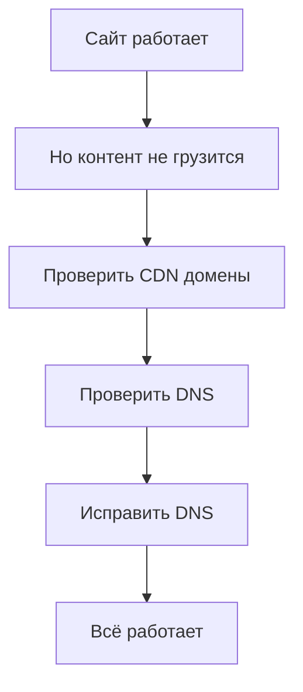

<p align="right">
  <a href="./README.md">English</a> | <b>Русский</b>
</p>

# 🛠️ Fix: YouTube открывается, но видео не загружается (проблема DNS / CDN на VPS)

## 📖 Обзор

Этот гайд объясняет, как диагностировать и исправить ситуацию, когда:

* YouTube (`youtube.com`) открывается
* Но видео **не загружается или не воспроизводится**

---

## 🌐 Как работает DNS

### 🔄 Стандартный процесс DNS-запроса



---

## 🎥 Как работает YouTube



👉 Важно:

* `youtube.com` → сайт
* `googlevideo.com` → видео

---

## ❌ Сценарий ошибки (твой случай)



---

## 🔍 Причина

Система использовала DNS-серверы провайдера, полученные через DHCP.

Пример:

```text
85.193.xxx.xxx
85.193.xxx.xxx
```

❌ Эти DNS-серверы возвращали некорректные или неполные ответы для CDN-доменов (например, `googlevideo.com`), что нарушало доставку видеоконтента.

---

## ✅ Исправленная схема



---

## 🌍 Почему DNS даёт разные ответы



---

## 🧠 Ключевая идея



---

# ⚙️ Настройка DNS (что редактировать и что прописать)

🇷🇺 Русский

В зависимости от системы, DNS может управляться через `systemd-resolved`, `netplan` или напрямую через `resolv.conf`.

---

## 🔹 Вариант 1: systemd-resolved (рекомендуется)

Отредактируйте файл:

`sudo nano /etc/systemd/resolved.conf`

Найдите или добавьте строки:

```
[Resolve]
DNS=1.1.1.1 8.8.8.8
FallbackDNS=1.0.0.1 8.8.4.4
DNSSEC=no
DNSOverTLS=no
```

Примените изменения:

`sudo systemctl restart systemd-resolved`

Проверьте:

`resolvectl status`

---

## 🔹 Вариант 2: Netplan (Ubuntu 18.04+)

Откройте конфигурацию (имя файла может отличаться):

`sudo nano /etc/netplan/01-netcfg.yaml`

Добавьте DNS-серверы:

```
network:
  version: 2
  ethernets:
    eth0:
      dhcp4: true
      nameservers:
        addresses:
          - 1.1.1.1
          - 8.8.8.8
```

Примените:

`sudo netplan apply`

---

## 🔹 Вариант 3: resolv.conf (временное решение)

`sudo nano /etc/resolv.conf`

Добавьте:

```
nameserver 1.1.1.1
nameserver 8.8.8.8
```

⚠️ Важно: этот файл может перезаписываться системой.

---

## 🏁 Вывод

Проблема была вызвана:

❌ DNS провайдера ломал резолв CDN
✔ Исправлено переходом на публичные DNS

После исправления:

* DNS работает корректно
* CDN доступен
* Видео YouTube воспроизводится

---
